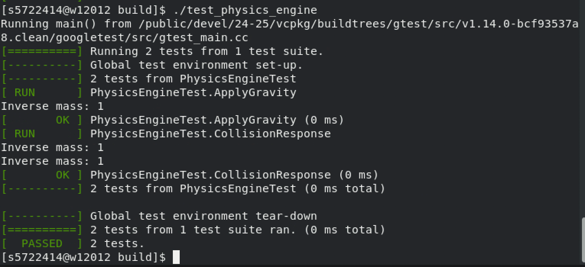
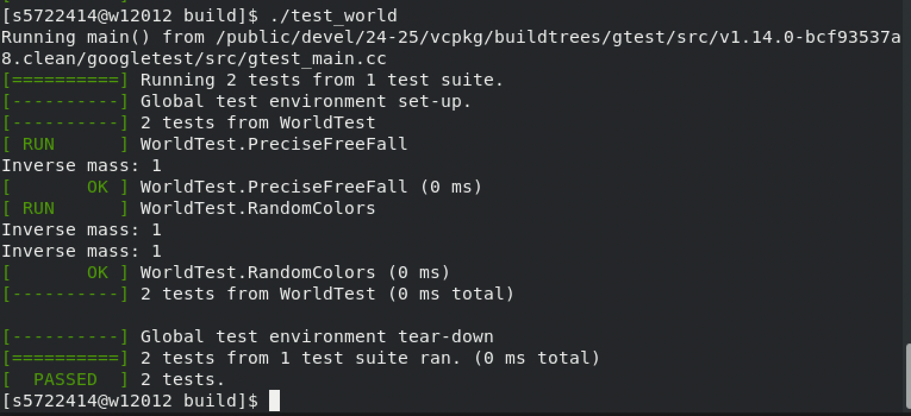
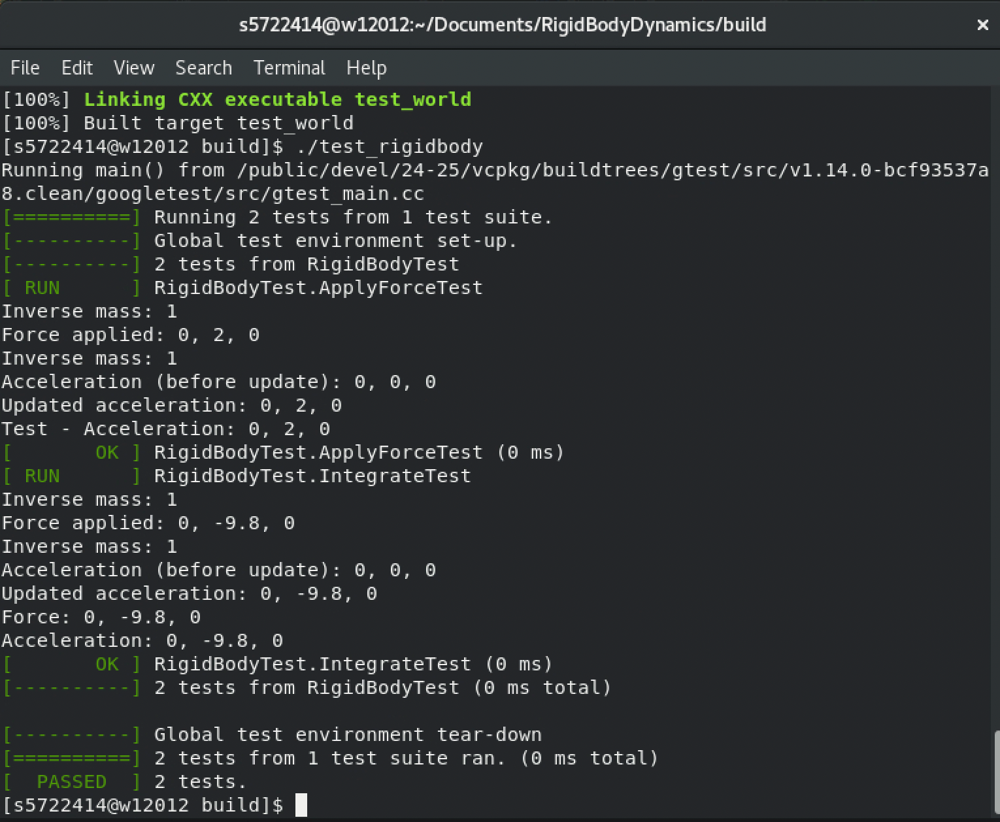
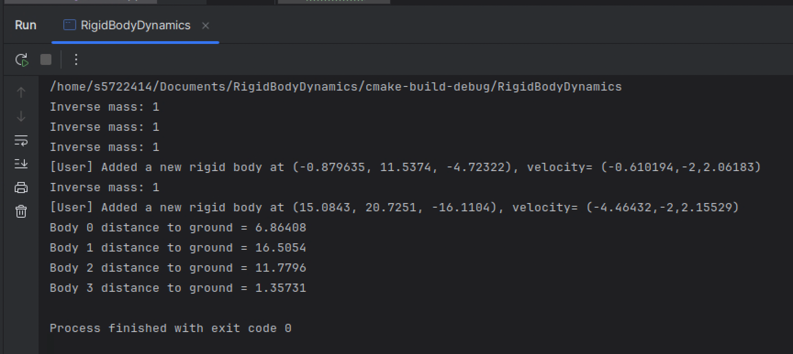

# RigidBodyDynamics: A Simple Rigid Body Dynamics Simulation

## Project Description

**RigidBodyDynamics** is a C++ project that simulates rigid body motion with real-time rendering using OpenGL. The simulation focuses on physically accurate dynamics, including collision detection and resolution, supported by Axis-Aligned Bounding Boxes (AABB) and impulse-based collision responses. It also provides interactive features for users to add objects or debug their behaviors dynamically.

---

## Features

- **Collision Detection**:
  - Broad-phase detection using AABB to determine potential collisions efficiently.
  - Narrow-phase detection for precise collision checks between objects.

- **Collision Response**:
  - Impulse-based resolution for physically accurate post-collision velocities.
  - Ground collision handling to prevent objects from penetrating the surface.

- **Real-Time Rendering**:
  - OpenGL-based visualization of spheres and a ground plane.
  - Randomized sphere colors for improved visualization.

- **User Interaction**:
  - Add new rigid bodies dynamically using the keyboard.
  - Debug and analyze object properties during runtime.

---

## Design

### Data Structures and Classes

The project is implemented using an object-oriented design. Below is an overview of key classes:

- **`RigidBody`**:
  Represents a single rigid body with properties like position, velocity, acceleration, mass, and radius. Includes methods for applying forces and integrating motion.

- **`World`**:
  Manages all rigid bodies and the simulation environment. Handles adding rigid bodies, simulating physics, and rendering the scene.

- **`PhysicsEngine`**:
  Updates the motion of rigid bodies, applies gravity, and handles collision resolution.

- **`CollisionDetector`**:
  Detects collisions between rigid bodies and the ground. Resolves collisions to ensure objects behave realistically.

- **`Renderer`**:
  Handles OpenGL rendering, including drawing spheres, ground planes, and applying visual properties like random colors.

### Algorithms

- **Collision Detection**:
  - **AABB** is used for efficient collision detection between objects and the ground.
  - Pairwise narrow-phase checks ensure accurate detection for overlapping objects.

- **Collision Response**:
  - Uses an impulse-based method to calculate new velocities for colliding objects.
  - Fully elastic collisions (restitution = 1.0) are assumed for simplicity.

- **Rendering**:
  - OpenGL is used to draw objects in real-time.
  - Randomized sphere colors enhance the visual appeal of the simulation.

---

## User Interaction Controls

### Keyboard Controls

- **Spacebar**:  
  Adds a new rigid body (sphere) to the simulation.
  - The sphere is placed at a random position above the highest existing sphere.
  - It has a random initial velocity and color.  
    Example console output when pressing Space:
    [User] Added a new rigid body at (10.23, 15.0, -5.67), velocity= (2.4, -2.0, 1.5)

- **D Key**:  
  Prints the distance from each rigid body to the ground in the console.  
  Example console output when pressing D:
  Body 0 distance to ground = 3.42 Body 1 distance to ground = 7.89

---

## Installation and Usage

### Prerequisites

Before running the project, ensure the following tools and libraries are installed:

- **C++ Compiler**: A modern C++ compiler supporting C++17.
- **CMake**: For project configuration and build.
- **SDL2**: For window management.
- **GLEW**: For OpenGL extensions.
- **OpenGL**: For rendering graphics.

### Building the Project

1. Clone the repository:
 ```bash
 git clone git@github.com:NCCA/programming-project-Flora9822.git
 cd RigidBodyDynamics
2.Create a build directory and configure the project using CMake:
3.mkdir build
4.cd build
5.cmake ..
6.Build the project:
7.cmake --build .
Running the Application
Run the executable generated after building:
./RigidBodyDynamics
Testing the Application
Unit tests are included to ensure functionality:
./test_physics_engine
./test_world

---

## Concept Proof

### Unit Tests
1. **test_physics_engine**  
   Verifies physics calculations such as gravity application and collision responses.  

   

2. **test_world**  
   Ensures rigid body addition and rendering logic work correctly.  

   

3. **test_rigidbody**  
   Validates individual rigid body logic.  

   

### Basic Example
A simple application to render a ground plane and multiple spheres, allowing user interactions to dynamically add objects or debug distances.  

   

---

## License

This project is licensed under the Apache License 2.0 - see the [LICENSE](./LICENSE) file for details.
