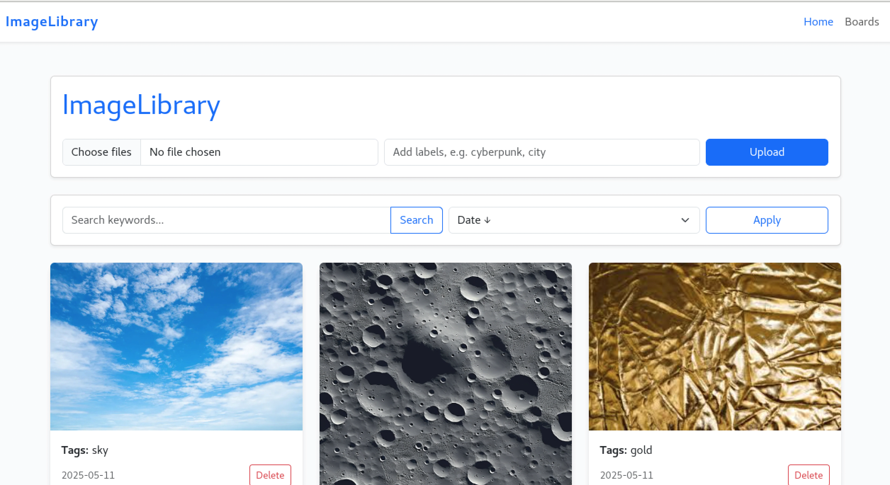
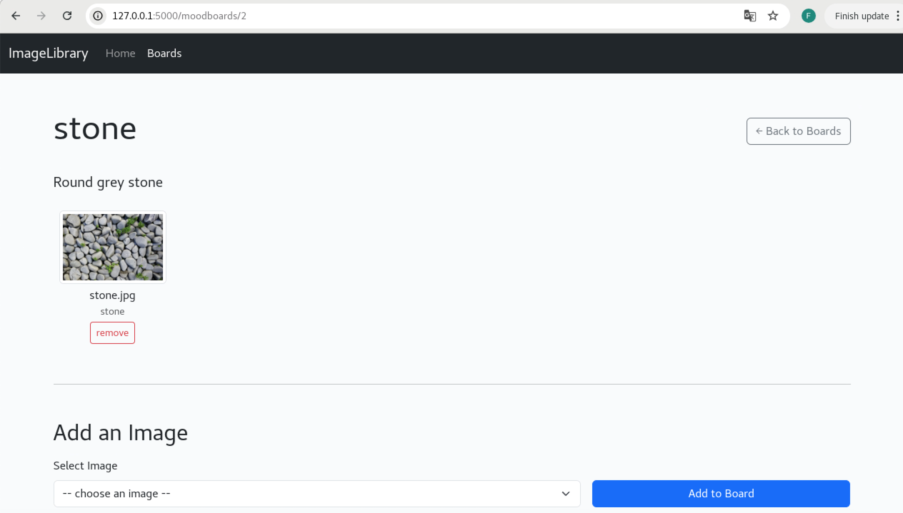

# ImageLibrary

[]

**ImageLibrary** is a web-based 2D image reference database inspired by PureRef. It enables users to upload, tag, search, and organize images into custom moodboards, with support for containerized deployment and one‑step setup.

## Features

* **Upload & Tag**: Add multiple images with labels for quick categorization.
* **Search & Sort**: Filter images by keywords (case‑insensitive, partial matches) and sort by date or filename.
* **Moodboards**: Create, view, and manage multiple boards; add/remove images without duplicates.
* **Responsive UI**: Mobile‑friendly design using Bootstrap.
* **Tests & CI**: Full coverage with pytest; automatic checks via GitHub Actions and Codecov.
* **Containerized**: Docker Compose for one‑command deployment; supports Podman.

## Tech Stack

* **Backend**: Flask (Python 3.11) with SQLite by default (configurable to MySQL/PostgreSQL)
* **Frontend**: HTML, CSS, Bootstrap 5
* **Testing**: pytest, pytest-cov
* **CI/CD**: GitHub Actions, Codecov
* **Deployment**: Docker, Docker Compose (or Podman)

---

## Quick Start

Follow these steps to get ImageLibrary running on your machine or server.

### 1. Clone & Environment Setup

```bash
git clone git@github.com:NCCA/pipeline-project-Flora9822.git
cd pipeline-project-Flora9822
```

#### a. Local Python Setup

```bash
python3 -m venv .venv
source .venv/bin/activate
pip install --upgrade pip
pip install -r requirements.txt
```

#### b. Environment Variables

Copy the example and configure:

```bash
cp .env.example .env
```

### 2. Initialize Database & Run Locally

Use the setup script for full automation:

```bash
chmod +x setup.sh
./setup.sh
```

This will:

1. Activate `.venv` and install dependencies
2. Initialize SQLite database (`flask init-db`)
3. Launch the Flask development server on [http://127.0.0.1:5000](http://127.0.0.1:5000)

Alternatively, manually:

```bash
flask init-db
flask run
```

### 3. Docker Compose Deployment

Requires Docker & Docker Compose (or Podman).

```bash
docker-compose up -d --build or podman-compose up -d --build

```

* **Ports**: Exposes port `5000` → `5000`
* **Volumes**: Persists uploads in `./static/uploads`

Visit [http://localhost:5000](http://localhost:5000) to use the app.

To stop and remove containers:

```bash
docker-compose down
```

---

## Environment Configuration

Environment variables are defined in `.env` (not committed). Key settings:

```dotenv
FLASK_APP=app.py
FLASK_ENV=development    # change to production in prod
SECRET_KEY=your-secret-key
UPLOAD_FOLDER=static/uploads
# DATABASE_URL for non-SQLite databases
```

## Usage

* **Home** (`/`): Upload images, search by tags, sort results, delete images.
* **Boards** (`/moodboards`): Create boards, add images, view board contents.

Example `curl` commands:

```bash
# Upload an image
curl -X POST -F "image=@path/pic.png" -F "tags=city,night" http://localhost:5000/

# Create a moodboard
curl -X POST -d "name=Inspo" -d "description=Night scenes" http://localhost:5000/moodboards/create

# Add image to moodboard
curl -X POST -d "image_id=1" http://localhost:5000/moodboards/1
```

---

## Testing

Run unit tests and view coverage:

```bash
pytest --cov=app --cov-report=term-missing
```

CI is configured via **.github/workflows/ci.yml** to run tests and upload coverage to Codecov.

---

## Architecture & Docs

* **Architecture**: See [docs/ARCHITECTURE.md](docs/ARCHITECTURE.md)
* **ADR**: See [docs/ADR.md](docs/ADR.md)
* **API**: See [docs/API.md](docs/API.md)

---

## Screenshots

<div align="center">
  
  
  
  
</div>

---

## Contributing

1. Fork the repo and create a branch:

   ```bash
   ```

git checkout -b feature/your-feature

````
2. Make your changes, add tests, and commit:
   ```bash
git commit -m "feat: add new feature"
````

3. Push to your fork and open a PR.

---

## Acknowledgements

This project relies on the following open-source libraries:

- **Flask** (BSD-3-Clause) — https://palletsprojects.com/p/flask/  
- **Werkzeug** (BSD-3-Clause) — https://palletsprojects.com/p/werkzeug/  
- **Jinja2** (BSD-3-Clause) — https://palletsprojects.com/p/jinja/  
- **Bootstrap 5** (MIT) — https://getbootstrap.com/  
- **pytest** (MIT) — https://docs.pytest.org/  


---

## License

MIT © Flora
