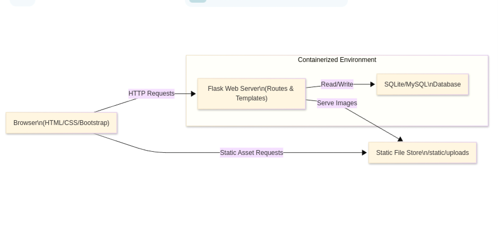
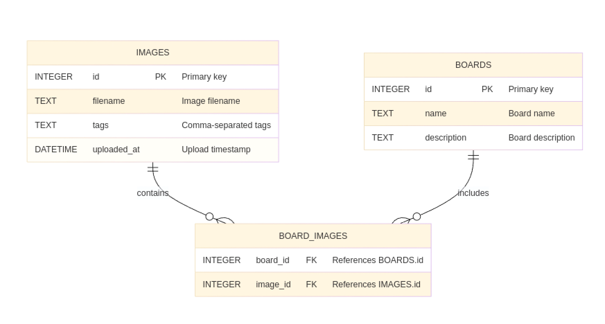

# ImageLibrary Architecture Documentation

This document describes the overall architecture, module organization, data flow, and database ER model for the ImageLibrary project.

---

## 1. System Architecture Overview



---

## 2. Database ER Diagram



---

## 3. Data Flow

1. **Upload Flow:**
   - User submits an image via browser form →
   - Flask validates and saves file to `/static/uploads` →
   - Metadata (filename, tags) is inserted into `IMAGES` table.

2. **Search Flow:**
   - User enters a keyword →
   - Flask performs a `LIKE` query on `IMAGES.tags` →
   - Matching records are rendered in the gallery view.

3. **Board Management:**
   - User creates a new board →
   - Entry added to `BOARDS` table →
   - User adds images to board →
   - Relationships recorded in `BOARD_IMAGES` table →
   - Board detail page renders via JOIN between `IMAGES` and `BOARD_IMAGES`.

---

## 4. Containerization Overview

We use Docker and Docker Compose to package and deploy:

```yaml
version: '3.8'
services:
  web:
    build: .
    ports:
      - "5000:5000"
    volumes:
      - ./static/uploads:/app/static/uploads
    environment:
      - FLASK_APP=app.py
      - FLASK_ENV=production
```

- The `web` service runs the Flask application.
- Uploaded images are persisted via a volume mapping to `static/uploads`.

---

